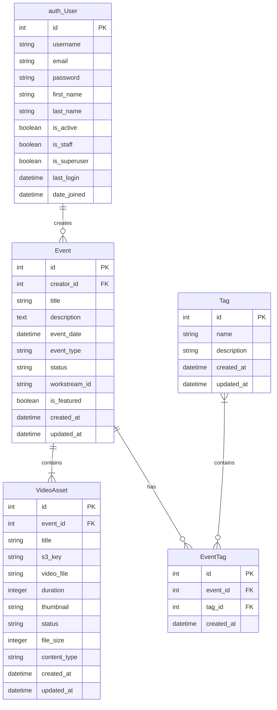

```mermaid

erDiagram
    auth_User ||--o{ Event : creates
    Event ||--|{ VideoAsset : contains
    Event ||--o{ EventTag : has
    Tag }|--o{ EventTag : contains
    
    %% Todo: Add Workstream Integration tables
    %% Event ||--o| WorkstreamEvent : links_to
    %% WorkstreamEvent ||--|{ WorkstreamComment : has
    %% WorkstreamEvent ||--|{ WorkstreamRating : has

    auth_User {
        int id PK
        string username
        string email
        string password
        string first_name
        string last_name
        boolean is_active
        boolean is_staff
        boolean is_superuser
        datetime last_login
        datetime date_joined
    }

    Event {
        int id PK
        int creator_id FK
        string title
        text description
        datetime event_date
        string event_type
        string status
        string workstream_id
        boolean is_featured
        datetime created_at
        datetime updated_at
    }

    VideoAsset {
        int id PK
        int event_id FK
        string title
        string s3_key
        string video_file
        integer duration
        string thumbnail
        string status
        integer file_size
        string content_type
        datetime created_at
        datetime updated_at
    }

    Tag {
        int id PK
        string name
        string description
        datetime created_at
        datetime updated_at
    }

    EventTag {
        int id PK
        int event_id FK
        int tag_id FK
        datetime created_at
    }

    %% WorkstreamEvent {
    %%     int id PK
    %%     string workstream_id
    %%     string title
    %%     text description
    %%     datetime event_date
    %%     string status
    %%     string requester_email
    %%     string presenter_email
    %%     datetime created_at
    %%     datetime updated_at
    %% }

    %% WorkstreamComment {
    %%     int id PK
    %%     int workstream_event_id FK
    %%     string author_email
    %%     text content
    %%     datetime created_at
    %%     datetime updated_at
    %% }

    %% WorkstreamRating {
    %%     int id PK
    %%     int workstream_event_id FK
    %%     string user_email
    %%     integer rating
    %%     datetime created_at
    %% }

```